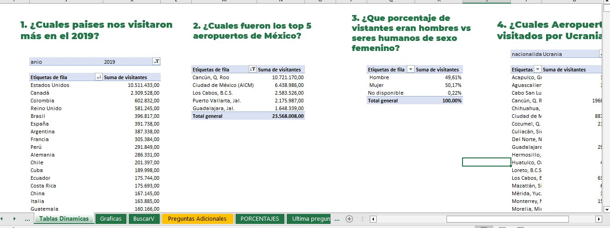
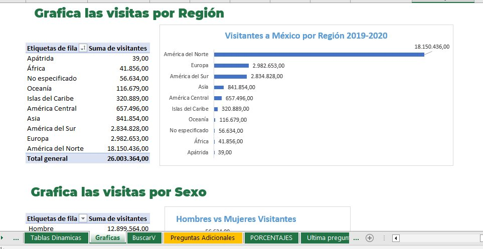

# 5 PREGUNTAS DE ENTREVISTA TÉCNICA EXCEL

Una práctica de EXCEL sobre una base de datos ficticia de Visitantes a México y los aeropuertos.

# Targets

* 1¿Cuales paises nos visitaron más en el 2019?
* 2.¿Cuales fueron los top 5 aeropuertos de México?
* 3.¿Que porcentaje de vistantes eran hombres vs seres humanos de sexo femenino?
* 4.¿Cuales Aeropuertos fueron visitados por Ucranianos?
* Grafica las visitas por Región, por Sexo y a lo largo del tiempo.
* Usar la función BuscarV, tablas dinámicas, gráficas, porcentajes.

## Screenshot

